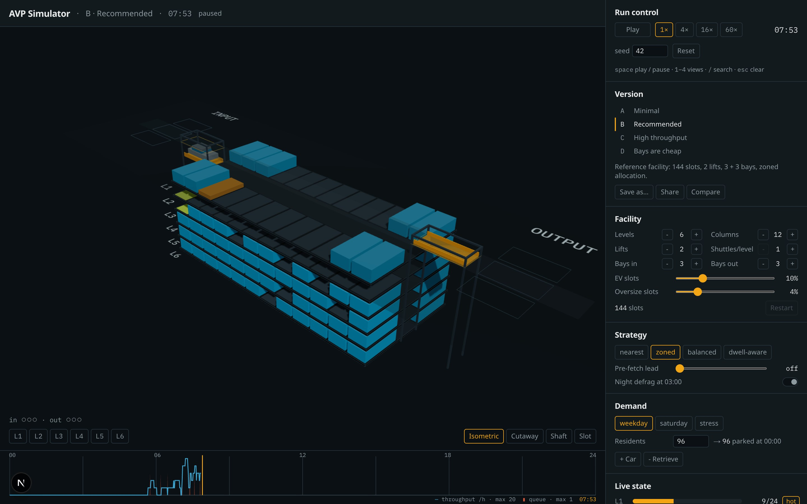
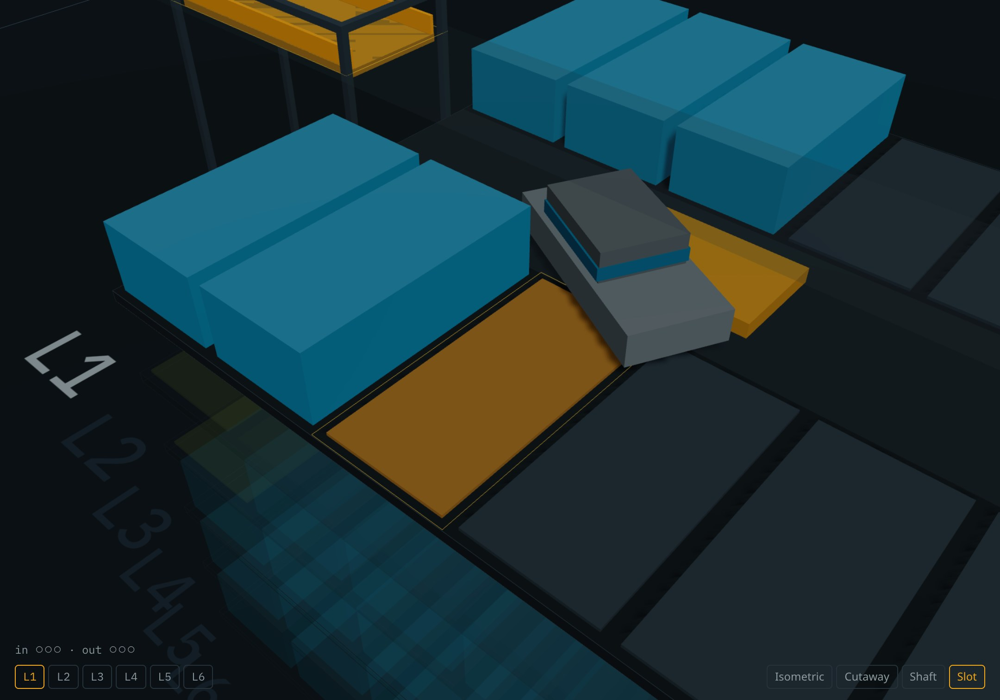
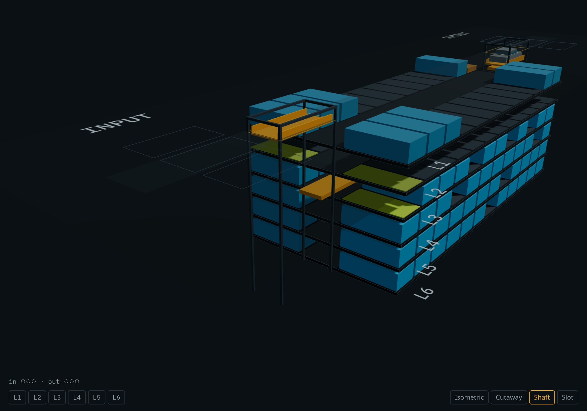
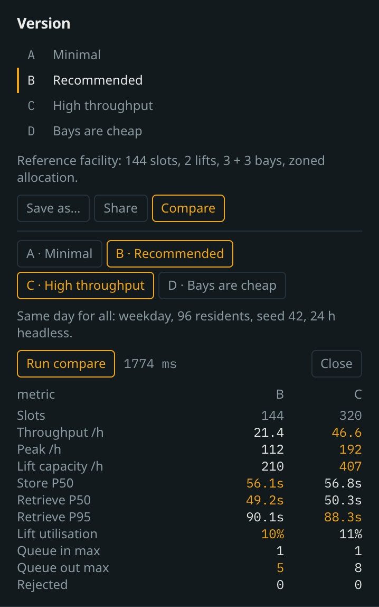

# AVP Simulator

Interactive 3D simulator of an automated underground vehicle-parking facility (AVP): cars are
dropped in a bay, a lift takes them down, a shuttle slides them into a slot — and back again
when the driver calls. Everything runs in the browser: a deterministic simulation engine, a
three.js scene that only visualises engine state, and a control panel to change the facility,
the strategy and the demand while it runs.



The project is specified in [`SPEC.md`](./SPEC.md) and built milestone by milestone (M0 → M6).
Working rules for contributors and agents are in [`CLAUDE.md`](./CLAUDE.md). Progress and
measured numbers: [`STATUS.md`](./STATUS.md). How the spec's open points were resolved:
[`DECISIONS.md`](./DECISIONS.md).

## Run it

```sh
pnpm install
pnpm dev        # http://localhost:3000
pnpm typecheck  # tsc --noEmit
pnpm lint
pnpm test       # vitest: engine, geometry, motion, panel logic, share links
pnpm build
pnpm bench --presets A,B,C,D --hours 24 [--demand weekday,stress] [--seed 42]

# scene checks / screenshots with headless Chrome (needs `pnpm dev` on :3000)
DPR=2 node scripts/screenshot.mjs http://localhost:3000/ scripts/shots/presets.js out/   # camera presets, FPS
DPR=2 node scripts/screenshot.mjs http://localhost:3000/ scripts/shots/stages.js out/    # a car at every stage
DPR=2 node scripts/screenshot.mjs http://localhost:3000/ scripts/shots/day60x.js out/    # 24 h at 60× (~24 min)
DPR=2 node scripts/screenshot.mjs http://localhost:3000/ scripts/shots/panel.js out/     # panel blocks + DOM interactions
DPR=2 node scripts/screenshot.mjs http://localhost:3000/ scripts/shots/versions.js out/  # compare timing, save, share
DPR=2 node scripts/screenshot.mjs http://localhost:3000/ scripts/shots/failures.js out/  # failures, shortcuts
```

## What you can do

| | |
|---|---|
| **Run** | play / pause, 1× 4× 16× 60×, seed, reset — `space` toggles, `1`–`4` pick a view, `/` jumps to search, `esc` clears the selection |
| **Versions** | presets A–D, any edit becomes a custom version; save (this browser, max 12), share a `?v=` link that reproduces the exact setup, compare 2–3 versions side by side (24 h each, in Web Workers, ~2 s) |
| **Facility** | levels, columns, lifts, shuttles per level, bays, EV / oversize mix — with a "Restart needed" badge until you apply |
| **Strategy** | allocator (nearest / zoned / balanced / dwell-aware), pre-fetch lead, night defrag — applied hot |
| **Demand** | weekday / saturday / stress profiles, residents, `+ Car`, `− Retrieve` |
| **Watch** | live occupancy per level, sparklines, percentiles, a searchable index that flies the camera to any car, the SQL-style event log, the 24 h timeline |
| **Break it** | lift down, shuttle down, power loss — the scene turns clay, jobs freeze or re-route, the spare shuttle steps in |

<p>
  
  
</p>



## Engine benchmark (24 h, seed 42, weekday demand)

| preset | slots | lift cap/h | lift cycle | store P50 | retrieve P50 | retrieve P95 |
| --- | --- | --- | --- | --- | --- | --- |
| A — minimal | 96 | 101 | 35.5 s | 56.7 s | 52.3 s | 129.3 s |
| B — recommended | 144 | 210 | 34.3 s | 56.1 s | 49.2 s | 90.1 s |
| C — high throughput | 320 | 407 | 35.4 s | 56.8 s | 50.3 s | 88.3 s |
| D — bays are cheap | 144 | 211 | 34.2 s | 55.7 s | 48.7 s | 89.8 s |

`pnpm bench --presets A,B,C,D --hours 24 --demand weekday,stress` prints the full table
(throughput, peak, utilisation, queues, rejections); the numbers above are the §2 targets the
engine reproduces within ±15 % (`tests/engine.timings.test.ts`).

## Quality gates

`pnpm lint`, `pnpm typecheck`, `pnpm test` (61 tests) and `pnpm build` are green at every
milestone. Lighthouse on the production build (Chrome 153, headless): accessibility **100**,
best practices **100**. Keyboard focus is visible everywhere; `prefers-reduced-motion` turns
camera flights into cuts and digit rolls into plain updates.

Car models and fonts: IBM Plex Mono (OFL) is self-hosted for the 3D labels; see
`public/fonts/LICENSE.txt`.
